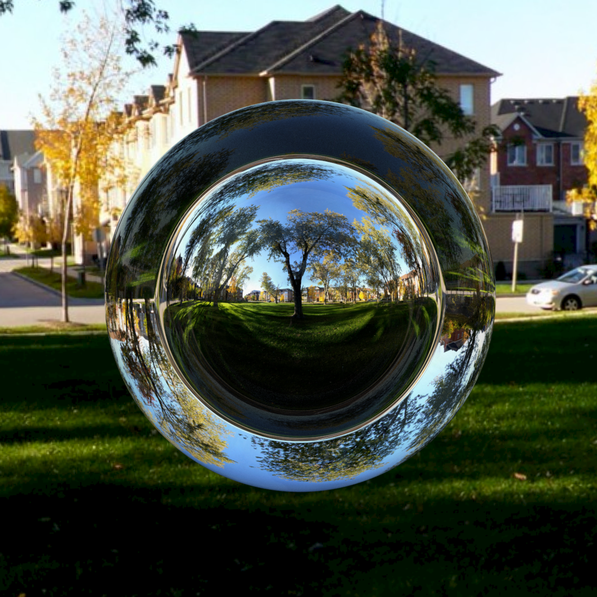
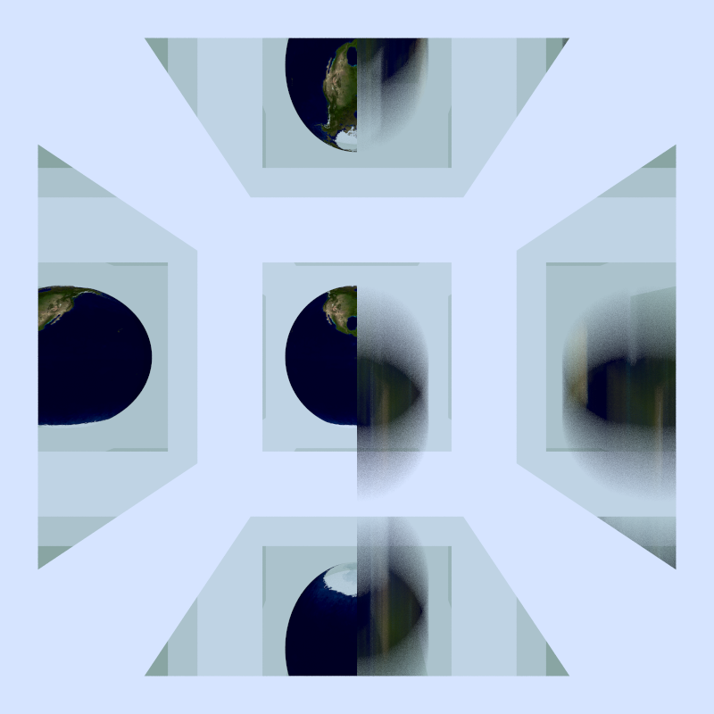

# Ray Tracer

A physically-based, offline **CPU ray tracer written from scratch in C++**. It supports textured
primitives and triangle meshes, emissive materials, a BVH acceleration structure (aabb), stochastic
sampling, OpenMP parallelism, and more.

Built following Peter Shirley's *Ray Tracing in One Weekend* series as a foundation, then
extended well beyond it. See [`Raytracer.pdf`](Raytracer.pdf) for the full write-up.

## Gallery

<table align="center">
  <tr>
    <td align="center">
      <br>
      <em>Glass sphere with a metal center in a park (cube-map)</em>
    </td>
    <td align="center">
      <br>
      <em>Two dice meshes shaded by nearby emissives; right die demonstrates normal interpolation</em>
    </td>
    
  </tr>
  <tr>
    <td align="center">
      <br>
      <em>Large, complex scene rendered in ~20 s with BVH + multithreading</em>
    </td>
    <td align="center">
      <br>
      <em>Earth-textured sphere flanked by green-tinted specular quads; left is static, right is falling</em>
    </td>
  </tr>
</table>

## Features

**Core rendering**
- Recursive path tracing with a fully configurable camera (position, orientation, FOV, resolution)
- Stochastic anti-aliasing (stratified sub-pixel sampling)
- Ray–sphere, ray–triangle, and ray-quad intersection; UV-textured spheres and triangles
- Ray intersections and UV texture mapping with spheres, triangles, and quads
- Diffuse, specular, dielectric, and emissive materials.
- Axis aligned bounding boxes for logarithmic-time intersection on complex scenes

**Camera effects**
- Motion blur: time-paramaterized rays and objects. Objects follow arbitrary position functions with bounding boxes built from adaptive sampling of each function's range

- Depth of field via thin-lens camera mode; configurable focus distance and defocus angle

**Advanced rendering**
- Triangle mesh loading from OBJ files (via tinyobjloader)
- Volumetric rendering (constant-density participating media)
- Procedural textures from Perlin noise
- Cube maps
- Normal interpolation for smooth mesh shading
- OpenMP CPU multithreading for per-pixel rendering
- Object instancing (translate/reuse geometry)

## Building

Requires **CMake ≥ 3.10** and a **C++17 compiler with OpenMP**. The build links `libgomp`, so a
GCC toolchain (e.g. MinGW-w64 on Windows, or GCC/Clang on Linux/macOS) is expected.

```bash
cmake -B build
cmake --build build
```

Or open the folder in VS Code with the CMake Tools extension and build from there.

## Running

The scene is chosen by the `switch` in `main()` (in [`src/main.cpp`](src/main.cpp)) — change the
case number to select a scene, then rebuild. The renderer writes a PPM image to standard output:

```bash
build/Raytracer.exe > results/image.ppm
```

Open `results/image.ppm` in a viewer that supports PPM (e.g. IrfanView)

> Model scenes (e.g. the dice) expect OBJ geometry under `assets/models/`. The material/texture
> files are included, but large `.obj` mesh files are not bundled — drop them in the matching
> `assets/models/<name>/` folder to run those scenes.

## Repository structure

```
raytracer/
├── src/                 # renderer source
│   ├── main.cpp         # scene definitions; pick a scene in main() switch
│   ├── camera.h         # camera model + render loop
│   ├── material.h       # diffuse/specular/dielectric/emissive materials
│   ├── sphere.h         # geometry
|   ├── quad.h           #   "
|   ├── triangle.h       #   "
|   ├── obj_mesh.h       #   "
|   ├── volume.h         #   "
│   ├── bvh.h            # bounding-volume hierarchy (aabb)
│   ├── texture.h,       # textures & environment
|   ├── image.h,         #   "
|   ├── cube_map.h       #   "
|   ├── perlin.h         #   "
│   ├── pdf.h, onb.h     # importance sampling (work in progress)
│   └── external/        # stb_image.h, tiny_obj_loader.h (third-party)
├── assets/              # render inputs
│   ├── images/          # textures (e.g. earthmap.jpg)
│   ├── cube_maps/        # six-image environment maps
│   └── models/          # OBJ materials/textures (add .obj geometry here)
├── saved_images/        # showcase renders
├── results/             # render output (image.ppm)
├── WIP/                 # standalone experiments and prototypes
├── Raytracer.pdf        # final report
└── CMakeLists.txt
```

## Implementation notes

**Diffuse materials.** Uses true Lambertian scattering: rays reflect away from the surface,
weighted toward the surface normal by sending each ray to a random point on a unit sphere
centered at the tip of the unit-normal ray (more physically based than sampling a hemisphere at
the point of incidence). Lambertian surfaces always scatter, rather than scattering only with
probability `(1 − reflectance)`.

**Gamma correction.** Brightness is computed linearly in RGB, but human perception is roughly
logarithmic, so colors are gamma-corrected before output — e.g. so `(127,127,127)` reads as about
half as bright as `(255,255,255)`.

## Future work

- Finish **importance sampling / PDF-based light sampling** (started in `pdf.h` and `onb.h`) to
  cut noise and speed convergence. The latest image in `results/` uses the current partial
  implementation.
- An **Eckart–Young (SVD) low-rank approximation** pass over rendered images as a stylized
  compression effect. Low ranks introduce banding for a "Ghost in the Shell" look
  (prototype in `WIP/Eckart_Young.cpp`; requires the Eigen library and the commented targets in
  `CMakeLists.txt`).
- GPU acceleration and physical simulation.

## `WIP/`

Standalone experiments and prototypes kept for reference (SVD/Eckart–Young image compression,
convolution, quaternions, a scene-graph sketch, and a sine approximation). These are not part of
the main build.

## Credits & references

- Peter Shirley, Trevor David Black, Steve Hollasch — *Ray Tracing in One Weekend* series. <https://raytracing.github.io/>
- [tinyobjloader](https://github.com/tinyobjloader/tinyobjloader) (OBJ loading) and [stb_image](https://github.com/nothings/stb) (image loading), included under `src/external/`.
- [OpenMP](https://www.openmp.org/) for CPU parallelism.
- Cube map textures by Emil Persson (Humus), CC-BY 3.0. <https://www.humus.name>
- Low-poly dice model from OpenGameArt.org (CC0).
